# Wikidata

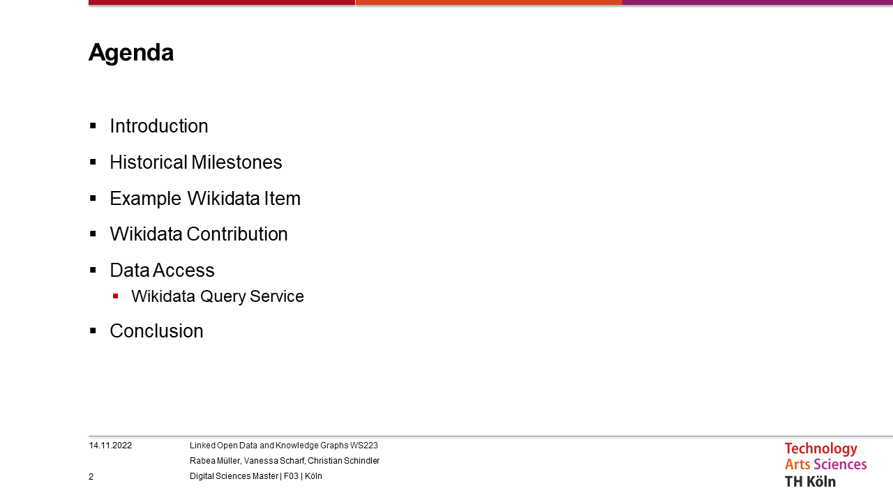

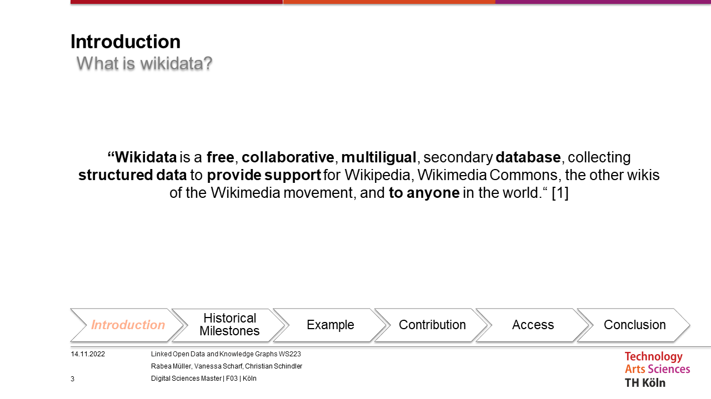

Free - Means not only that you have free access to data, but also that you are allowed to modify and re-upload the data and even use it for commercial purposes.
Collaborative - You can work simultanously on the data
Multilingual - Because of the language links, every information is available in every language after publication
Secondary Database - In this context, it means that this database is also referring to other databases with data
Structured Data - Data needs to have a specific structure to be able to be used
Anyone - Not only humans but even bots can contribute and access data

Source of the information: https://www.wikidata.org/wiki/Wikidata:Introduction

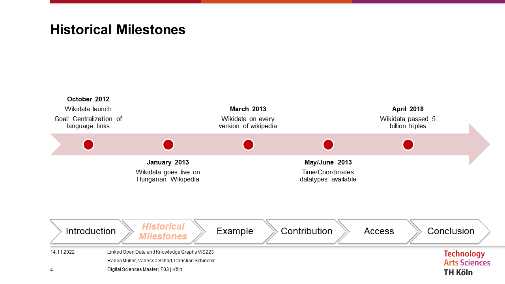

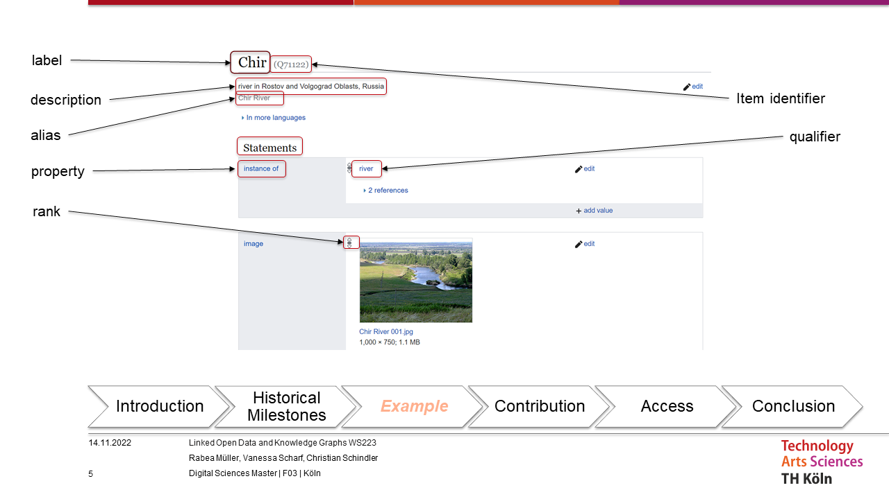

Label - A label is the exact name of a wikidata item
Item identifier - Identifies an item uniquely, always starts with Q followed by numbers
Description - Describes the wikidata item further with a set of characters
Alias - Other most common names and different spelling of the item
Statement - In a statement blog there is further linked information about the wikidata item. Linked information always needs to be referenced to a source
Property - Identifies a property uniquely, always starts with P followed by numbers. Properties specifies the "type" of an information
Qualifier - Links an item to a specific qualifier, so it links an item to an specific instance that this item belongs to
Rank - When there are multiple information regarding a specific statement, you can modify with the rank the most visible information. One good example would be population. When you have a population in year 2000 and want to update it to a more current value, like pupulation in year 2007, you add the value, add the reference that proves your value is right, set the rank of the population 2007 to a higher possibility and the rank of population in year 2000 to a lower possibility. 

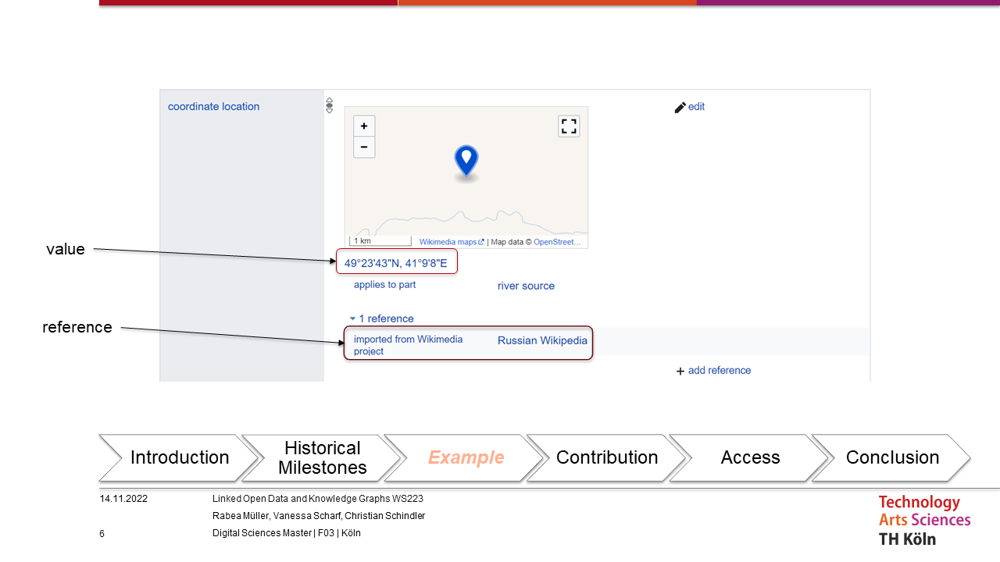

Value - The value of a property
Reference - The source to prove the information

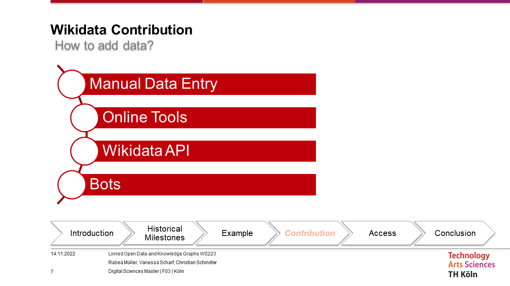

There are different possibilities to contribute data: automated, half-automated and manual
Different online tools:
    - Mix'n'Match: contains lists of important concepts from reliable sources and allows to match the names to Wikidata entries with one click
    - The primary source tool: allows for a curation workflow for data donations to Wikidata, where Wikidata editors can review, edit, or reject data offered to the community
    - Quickstatements 2: allows users to create items and upload lists of statements based on input in tab-separated format exported from spreadsheets
    - fatameh: allows users to create fully populated items about scientific papers with one click

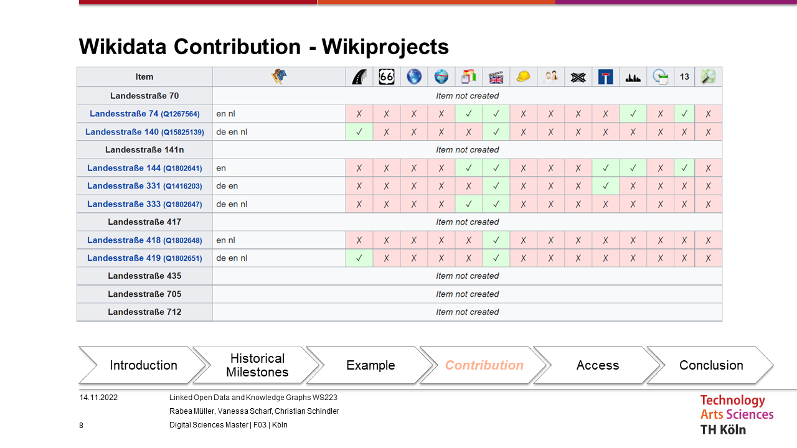

An example of a Wikidata Project - another possibility to contribute data. This project refers to streets in Northrhine-Westphalia (germany). As you can see there are still alot of missing values that you can contribute. The last column is the OpenStreetMapID. So the information is even linked to other services.

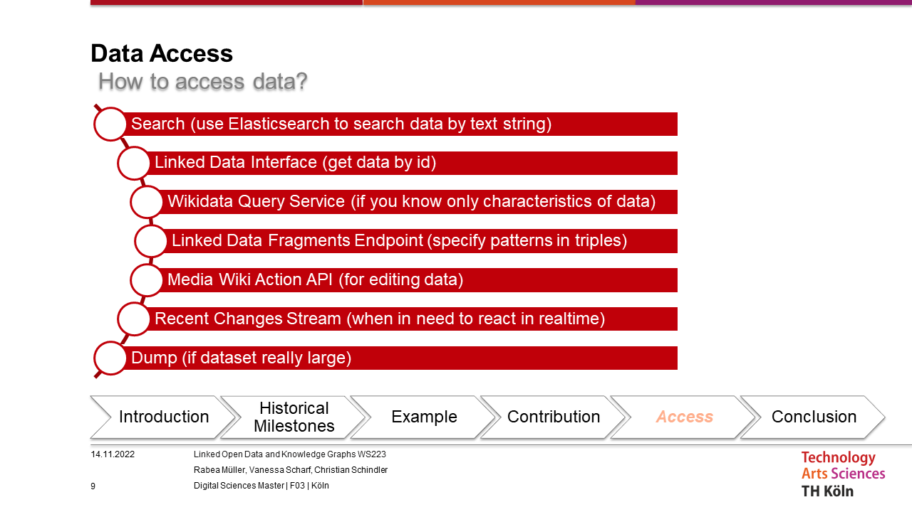

In this slide you can see the differnt possibilities to access wikidata with a short description of the most intended usecase.

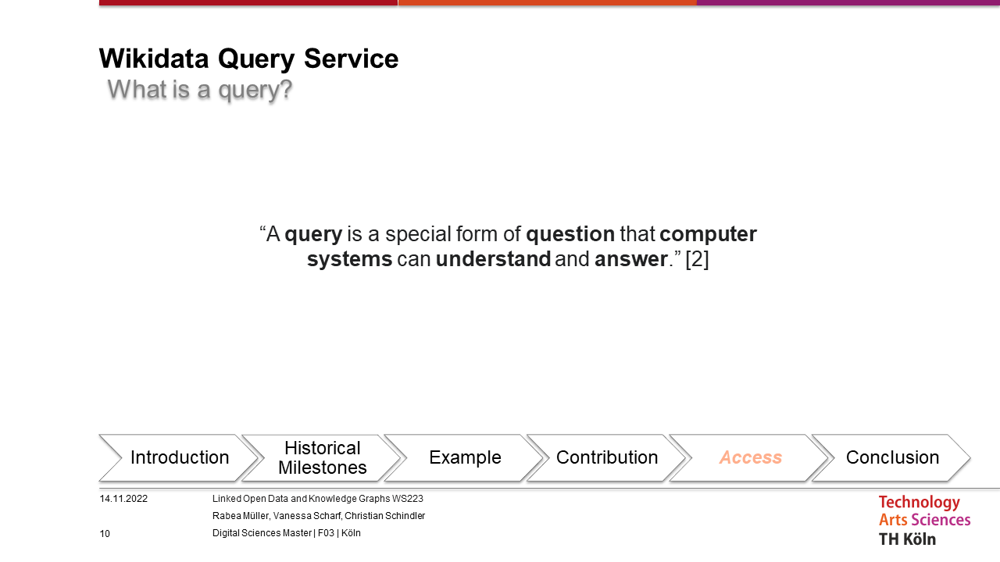

Source of information: https://www.wikidata.org/wiki/Wikidata:SPARQL_query_service/A_gentle_introduction_to_the_Wikidata_Query_Service

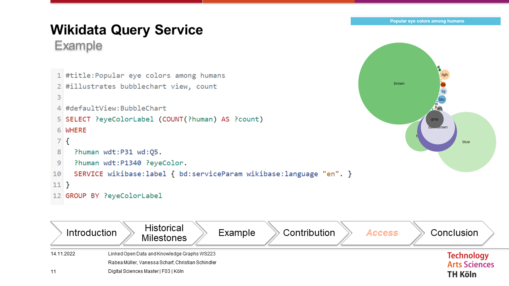

Wikidata Query Service is one of the possibilities to access data. Here you can see an example of the most common colors of human eyes. 
P31 is the property "instance of", Q5 is the item "human", P1340 is the property "hasEyecolor"

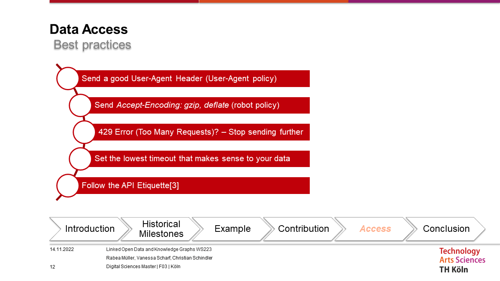

Some rules you should follow to access the data in the most efficiant way
Source of API Etiquette: https://www.mediawiki.org/wiki/API:Etiquette

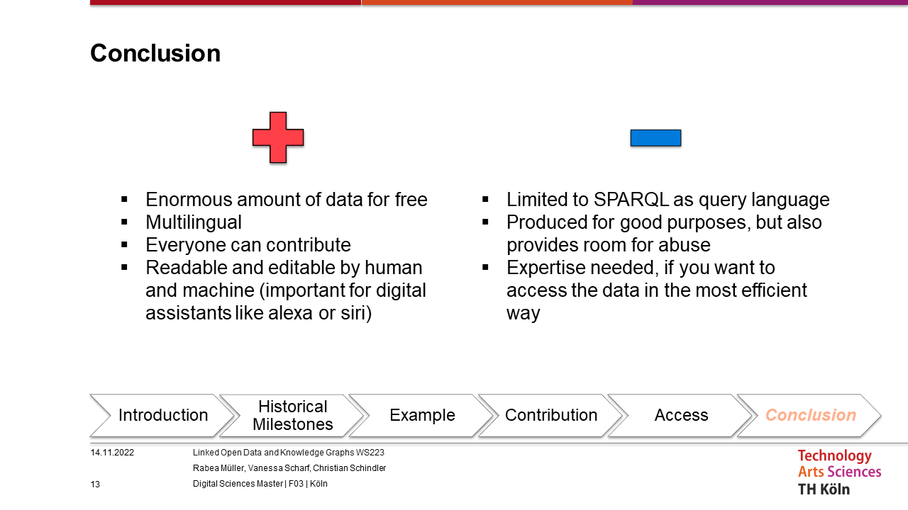

