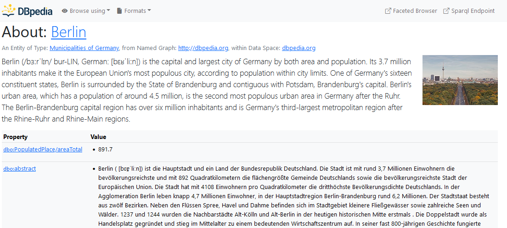
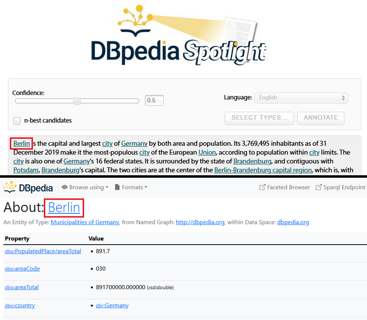
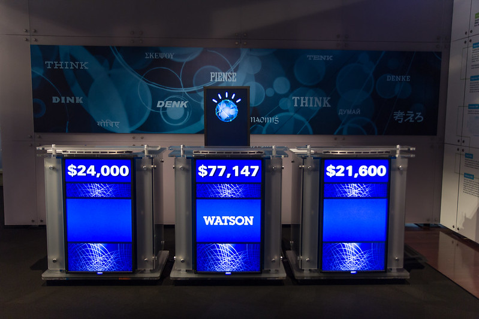

# DBPEDIA
```
by Natasha Randall and Anh Huy Matthias Tran
```
## Table of contents
- [Introduction](#introduction)
- [Why does DBpedia exist?](#why-does-dbpedia-exist)
	- Problems
	- Solutions
- [Extracting data from Wikipedia](#extracting-data)
	- Raw extraction
	- Mapping
	- NLP
- [DBpedia Ontology](#dbpedia-ontology)
- [DBpedia's Core Releases and Data Sets](#dbpedias-core-releases-and-data-sets)
- [Exploring DBpedia](#exploring-dbpedia)
	- SPARQL
	- Linked Data
	- DBpedia Lookup
- [DBpedia Applications](#dbpedia-applications)
- [Additional Use Cases](#use-cases)
	- A nucleus for linked data
	- DBpedia Spotlight
	- IBM Watson
- [References](#references)

---

## Introduction <a name="introduction"></a>

>   

DBpedia is a huge knowledge graph containing information extracted from Wikipedia, and is currently maintained as a crowd sourced, community effort. DBpedia was started in 2007 by Sören Auer and Jens Lehmann from the University of Leipzig, and Christian Bizer from the University of Mannheim, alongside the company "OpenLink Software", which develops database technologies.

## Why does DBpedia exist?  <a name="why-does-dbpedia-exist"></a>

Wikipedia is an incredible, large, complex source of information which has an extremely high volume of use; however it also has many **problems**.

* Wikipedia receives thousands of updates every hour as articles are being constantly updated by the community, which makes it difficult to maintain a definitive, reliable knowledge base.
* Wikipedia's huge scale in combination with its approach of community contributions to write pages, has resulted in many inconsistencies, ambiguities and incorrect statements written on Wikipedia articles.
* A Wikipedia user can only search Wikipedia by using very basic text matching which returns a single article, rather than being able to search for actual information using a more complex question.

>   
*Image 1: An example of vandalism on the Wikipedia page for Belgium.*

The DBpedia project attempts to provide **solutions** for these issues, particularly focusing on the last problem.

* Firstly, the "DBpedia Live Service" is constantly processing Wikipedia pages and updating the DBpedia knowledge graph respectively. The extracted data is therefore available in a structured format within DBpedia while also remaining up-to-date with a delay of only a few minutes.
* There are concerns that false information on Wikipedia, that has been added either maliciously or by mistake, could proliferate and be given legitimisation if added to the DBpedia knowledge graph automatically. However DBpedia contends that instead, it is positioned to be better able to identify contradictory information. Because DBpedia understands the semantics of the data, it can therefore recognise a problematic relation, for example, if a date of birth has been edited to occur after a date of death.
* Finally a core aspect of DBpedia is its advanced querying system. Because DBpedia is a knowledge graph that links and integrates large amounts of information together, rather than being simply a set of separate individual articles like Wikipedia, it can answer complex questions such as: *"name the musicians who play Jazz and were born in Berlin before 1990."* 

>   
*Image 2: A basic query written in natural language.*

The advantage of being able to write queries like this, is that they directly reflect the kind of questions we actually want answered when we are searching on Wikipedia. (Further information about making DBpedia queries can be found [here](#exploring-dbpedia).)

## Extracting data from Wikipedia  <a name="extracting-data"></a>

Before the information can be represented within DBpedia's knowledge graphs, it must firstly be extracted from Wikipedia.

Wikipedia articles contain many different types of data, both in structured and unstructured forms. For example, a typical article contains free text, infoboxes, categories, images, links to within and outside of Wikipedia and more. 

The main source of data for DBpedia is taken from the "infobox". The image below depicts one such infobox on Wikipedia, which describes the mathematician "Emmy Noether". 

>   
*Image 3: An example of a Wikipedia infobox (left) and the raw code creating it (right).*

Although the article pages do not use any explicit formal structured data schema, the stylistic formatting within the markup language that is used to display the pages, can be exploited by DBpedia. The infobox in particular is written in a very structured way, in order to create the table format.

**Raw extraction** very simply extracts the information from the infobox. The box is written in the form of attribute-value pairs, thus the extractor creates an RDF triple using the name of the article as the subject, the attribute as the predicate, and the value as the object. For example: subject: Emmy Noether, predicate: birth date, object: 23 March 1882.

The problem with this so called "raw extraction" is that the extracted data are not necessarily associated with any entities already existing in the linked data graph. Furthermore, in order to make it easier for users to contribute to articles, Wikipedia does not demand a high level of standardisation. Therefore attributes can often have very inconsistent names: for example, "birthPlace" "placeofbirth" or "birth_place" should all refer to the same relation, but would create different predicates.

>   
*Image 4: An example from DBpedia Mappings of mapping an attribute used in the "scientist infobox" onto the corresponding DBpedia ontology property.*

**Mapping** attempts to reconcile these inconsistencies through user created dictionaries in the "DBpedia Mappings Wiki". This community project attempts to map all of the possible variants of a particular attribute onto one consistent predicate as represented in the DBpedia ontology. Templates have also been created that can be applied to all articles describing the same object - such as a "scientist" - which also improves consistency.

Although extracting data from infoboxes makes up the core of DBpedia's knowledge base, a form of **NLP extraction** has also been developed, which can scrape information from the plain text of a Wikipedia article, in some limited use cases. This is achieved by using a vector space model, where a DBpedia entity is represented as a mathematical vector. If a word from within the plain text is also transformed into a vector, then these two vectors can be compared using metrics of similarity and closeness, and hence the likelihood that a DBpedia entity is associated with that word is computed. A further description of the technique of "Knowledge Graph Embeddings" is provided in the following document: [KG_Embeddings.md](https://github.com/foerstner-lab/2022-10-10-Master_Digital_Sciences-Linked_Open_Data_and_Knowledge_Graphs_WiSe_2022_2023/blob/main/content/basics/KG_Embeddings.md).

The extracted data in the form of RDF triples can then be added to the DBpedia knowledge graph.
## DBpedia Ontology <a name="#dbpedia-ontology"></a>
While initially manually created, DBpedia's Ontology evolved from being based on solely the most commonly used infoboxes within wikipedia to a crowd-sourcing effort resulting in a  cross-domain ontology via the DBpedia community and managed over the DBpedia Mappings wiki with daily snapshots.

As of today it covers:  
* 768+ Classes  
* 3000+ Properties  
* over 4,233,000+ Instances  
>   
*Image 5: An overview of DBpedia's ontology(2020).*

The Ontology can be assessed online in multiple ways:  
* [Direct download from DBpedia Databus](https://databus.dbpedia.org/ontologies/dbpedia.org/ontology--DEV)  
* [SPARQL Endpoint](http://dbpedia.org/sparql)

Additionally, DBpedia also allows for the direct exploration of its ontology in multiple ways:  
* [Public Mappings Wiki](http://mappings.dbpedia.org/server/ontology/classes/)  
* [Linked Data Interface](https://dbpedia.org/ontology/Place)  
* [Instance Dashboard](http://78.46.100.7:9000/)  
>   
*Image 6: An overview of DBpedia's ontology visualized in an interactive dashboard(2020).*

## DBpedia's Core Releases and Data Sets <a name="#dbpedias-core-releases-and-data-sets"></a>
DBpedia releases and updates its data sets core releases within a monthly cycle where:  
* **1st of each month**: Wikimedia prepares the monthly Wikipedia dump  
* **10th of each month**: Wikimedia makes the Wikipedia dump available  
* **15th of each month**: Extraction via automated [MARVIN Release Bot](https://release-dashboard.dbpedia.org/)

The core releases include multiple types of data sets of varying degrees of scale, topic and language scopes and can be directly downloaded at [DBpedia Databus](https://databus.dbpedia.org/dbpedia/collections/latest-core)
>   
*Image 7: An overview of DBpedia's Knowledge Graph core releases relative to the size of other known KGs(2021).*

Typical types of core releases include the subset **Tiny Diamond**, which includes:  
* Factual data from articles and infoboxes from the English Wikipedia Language Edition  
* Labels and Abstracts  
* Links & URI  
* `rdf:type` statements for ontologies  
* over 900 million triplets as of January 2021

With triplets being:  
- A set of three entities  
- codyfying a statement about semantic data  
>   
*Image 8: A simplified visualization of a triplet.*

## Exploring DBpedia <a name="#exploring-dbpedia"></a>
Exploring DBpedia's datasets can be achieved through multiple measures including but not only:  
* [Direct SPARQL Endpoint](http://dbpedia.org/sparql)  
* [Linked Data Access](https://www.dbpedia.org/resources/linked-data/)  
* [DBpedia's LookupSearch](https://lookup.dbpedia.org/)  
* REST API & cUrl commands  
* Community Applications

### SPARQL ENDPOINT
Via a public SPARQL Endpoint, users can execute queries against DBpedia's Wikipedia data. The endpoint can be found at [http://dbpedia.org/sparql](http://dbpedia.org/sparql) and is enabled by an `OpenLink Virtuoso Server` as both the back-end SPARQL query engine and the front-end HTTP/SPARQL server.
With a simple SPARQL query , we can use this example query to search for the entities, names and english abstracts of `adventure films` in the DBpedia dataset:
```
SELECT DISTINCT ?film, ?name, ?abstract
WHERE
     {
        ?film dbo:wikiPageWikiLink dbr:Adventure_film .
        ?film rdfs:comment ?abstract .
        ?film dbp:name ?name .
        FILTER ( LANG ( ?abstract ) = 'en' )
}
```
### SNORQL
A similar feat can be achieved through the [SNORQL user interface](https://dbpedia.org/snorql/?query=SELECT+%3Fname+%3Fbirth+%3Fdescription+%3Fperson+WHERE+%7B%0D%0A++++++%3Fperson+a+dbo%3AMusicalArtist+.%0D%0A++++++%3Fperson+dbo%3AbirthPlace+%3ABerlin+.%0D%0A++++++%3Fperson+dbo%3AbirthDate+%3Fbirth+.%0D%0A++++++%3Fperson+foaf%3Aname+%3Fname+.%0D%0A++++++%3Fperson+rdfs%3Acomment+%3Fdescription+.%0D%0A++++++FILTER+%28LANG%28%3Fdescription%29+%3D+%27en%27%29+.+%0D%0A%7D+ORDER+BY+%3Fname), which also accesses the DBpedia SPARQL endpoint.
```
SELECT ?name ?birth ?description ?person WHERE {
      ?person a dbo:MusicalArtist .
      ?person dbo:birthPlace :Berlin .
      ?person dbo:birthDate ?birth .
      ?person foaf:name ?name .
      ?person rdfs:comment ?description .
      FILTER (LANG(?description) = 'en') . 
} ORDER BY ?name
```

### Linked Data Access
DBpedia's Linked Data can be accessed using Semantic Web browsers, allowing users to navigate between different data sources by following self-describing RDF links.  
This enables users to start their journey off one data source and move through potentially endless web of data sources, all connected through RDF links, while also allowing robots of Semantic Web search engines to follow these links and crawl the Semantic Web.  

DBpedia's data set served as Linked Data can be assessed through DBpedia's Linked Data Interface via multiple means such as:  
* Default WWW Browsers  
* Semantic Web Browsers (DISCO, Marbles, OpenLink Data Explorer)  
* Programmatically with `curl` or RDF tools(Apache Jena, Rapper)  

Within DBpedia's Endpoint, dereferenceable URI are provided for data extracted from the English Wikipedia.  
As such, for each Wikipedia page, DBpedia offers the same entity within the public Linked Data Interface in the following pattern:  
`http://en.wikipedia.org/wiki/Berlin` -> `http://dbpedia.org/resource/Berlin`  

>   
*Image 9: The LOD Entity of Berlin in DBpedia.*

### Lookup Search
DBpedia also offers a functional entity retrieval service for their Linked Data, involving the use of keywords, prefixes, natural language and more related to the URI in the DBpedia knowledge graph, named DBpedia Lookup.  
[DBpedia Lookup](https://lookup.dbpedia.org/) retrieves relevant entities by matching the labels or the abstracts of a resource or the anchor text to the given search specifications, giving the user access for a simple, customizable way to retrieve specific DBpedia identifiers  

As such, it offers the following features for finetuning the search:   
* Scoring Function  
* Single Keyword Search  
* Prefix Search  
* Individual Search Parameters  
	* **Query**: Keyword(s) to be looked up  
	* **type/QueryClass**: Types of DBpedia classes from the DBpedia Ontology to be included in the results  
	* **maxResults**: Maximum amount of results retrieved  

DBpedia Lookup is also available as a Databus Collection Download including pre-built Indexes for local experiments:  
[https://github.com/dbpedia/lookup-application](https://github.com/dbpedia/lookup-application)
## DBpedia Applications <a name="#dbpedia-applications"></a>
As a crowd-sourced community effort, DBpedia allows for various extensions and applications to be implemented alongside its general ecosystem. and as DBpedia evolves, more and more of its community members developed DBpedia-related material and applications, which access the DBpedia ecosystem.
This includes special visualization apps, retrieval apps or other useful related apps which utilize the DBpedia data sets.  
[https://www.dbpedia.org/community/data-tools-services/](https://www.dbpedia.org/community/data-tools-services/)  

As a quick overview, here are a set of interesting DBpedia related applications, that can be used in order to gain a greater insight into the data set:  

### LODMILLA
LODMilla is a DBPedia visualization service aiming at portraying visual associations in LOD Graphs.
>   
*Image 10: LODMilla Visualization of BBC and a few select neighbours.*  
[https://lodmilla.sztaki.hu/lodmilla/?id=hhaeuotogto2k565i7644folcg](https://lodmilla.sztaki.hu/lodmilla/?id=hhaeuotogto2k565i7644folcg)

### LODLIVE
Another visualization service enabling and browsing LOD entities in a Graph.
>   
*Image 11: LODLIVE Visualization of the movie 'The Lord of the Rings'.*  
[http://en.lodlive.it/?http%3A%2F%2Fdbpedia.org%2Fresource%2FThe_Lord_of_the_Rings](http://en.lodlive.it/?http%3A%2F%2Fdbpedia.org%2Fresource%2FThe_Lord_of_the_Rings)

### Wikiyarn
A special application to browse Wikipedia via the DBpedia data sets in an alternative, more concise manner.  
>   
*Image 12: Wikiyarn view of the Entity 'Barack Obama' and its related neighbours.*
[https://www.wikiyarn.com/](https://www.wikiyarn.com/)  

More extensions and applications using DBpedia can be found [here](https://www.dbpedia.org/community/data-tools-services/).
## Additional Use Cases   <a name="use-cases"></a>

Because DBpedia extracts its data from Wikipedia, it therefore contains a huge amount of information on an extremely wide number of topics. Because of this, DBpedia has over time become a **"hub" or "nucleus" for other linked data graphs** which link to DBpedia in order to reference its large amount of resources. The number of incoming links pointing from other datasets to DBpedia is said to be in excess of 40 million. Image 13 depicts the connections between DBpedia and other open linked data graphs.

Furthermore, DBpedia itself links out to other datasets in order to enrich its own information. For example, using a "Semantic Web Browser" (or a "Linked Data Browser"), a user could easily move from the DBpedia entity for the country "Spain", to information about Spain stored in the EuroStat or CIA World Factbook linked datasets. 

>   
*Image 13: A graph showing the relations between DBpedia and other linked datasets.  
Jentzsch, A. (2011) "LOD Cloud Diagram". Wikimedia Commons. https://w.wiki/5uGu. Distributed under CC BY-SA 3.0.*

Because Wikipedia has such a broad topic coverage, this also means that references to DBpedia entities likely exist in text written about almost anything. The NLP extractor systems using vector space models, originally developed to scrape the natural language text in Wikipedia articles, can be extended to work on any plain text.

**DBpedia spotlight** is a tool which performs "entity recognition", processing plain text and automatically recognising any mentions of a related DBpedia entity. This allows for unstructured information, even outside of Wikipedia, to be linked to the knowledge graph. Image 14 shows DBpedia spotlight running on a paragraph of text, and automatically recognising that the first word refers to the city of Berlin as described in the DBpedia ontology.

>   
*Image 14: An example of DBpedia Spotlight running on plain text (above) and the related entity associated with the first term (below).*

Finally, not only people can benefit from DBpedia. In 2004, IBM wanted to try to create a machine that could win the American game show "Jeopardy". Such a machine would need to not only have a large knowledge base - that was machine-readable - to draw upon, but it would also need to be able to query this knowledge base for information based on questions that were asked in a natural language. 

DBpedia was chosen as one of the data sources for "Watson", as it was very well suited for such a task. The kind of questions asked on Jeopardy, such as:   
Question: "They’re the two states you could be re-entering if you’re crossing Florida’s northern border."  
Answer: "Georgia and Alabama"  
can be expressed in the form of a knowledge graph query similar to: "name places, that are federal states, that are in the country: United States, that border Florida to the North".

>   
*Image 15 A photo of a replica of IBM Watson's Jeopardy game.  
Atomic Taco (2013) "Watson and Two Other Jeopardy Podiums". Flickr. https://flic.kr/p/kH3T2c. Distributed under CC BY-SA 2.0.*

Watson ended up winning its televised Jeopardy match against 2 human champions, affirming the real potential of knowledge graphs such as DBpedia as an effective, query-able source of knowledge.

---

## References <a name="references"></a>

Auer, S., Bizer, C., Kobilarov, G., Lehmann, J., Cyganiak, R., & Ives, Z. (2007). Dbpedia: A nucleus for a web of open data. In The semantic web (pp. 722-735). Springer, Berlin, Heidelberg.

Lehmann, J., Isele, R., Jakob, M., Jentzsch, A., Kontokostas, D., Mendes, P. N., ... & Bizer, C. (2015). Dbpedia–a large-scale, multilingual knowledge base extracted from wikipedia. Semantic web, 6(2), 167-195.

Bizer, C., Lehmann, J., Kobilarov, G., Auer, S., Becker, C., Cyganiak, R., & Hellmann, S. (2009). Dbpedia-a crystallization point for the web of data. Journal of web semantics, 7(3), 154-165.

Daiber, J., Jakob, M., Hokamp, C., & Mendes, P. N. (2013, September). Improving efficiency and accuracy in multilingual entity extraction. In Proceedings of the 9th international conference on semantic systems (pp. 121-124).

Ferré, S. (2017) Sparklis: An Expressive Query Builder for SPARQL Endpoints with Guidance in Natural Language. Semantic Web 8(3) : 405-418.

Ferrucci, D., Brown, E., Chu-Carroll, J., Fan, J., Gondek, D., Kalyanpur, A. A., ... & Welty, C. (2010). Building Watson: An overview of the DeepQA project. AI magazine, 31(3), 59-79.

http://wikidata.dbpedia.org/about

https://www.dbpedia.org/about/

https://www.dbpedia.org/blog/dbpedia-snapshot-2022-03-release/

https://en.wikipedia.org/wiki/Wikipedia:Statistics

http://mappings.dbpedia.org/