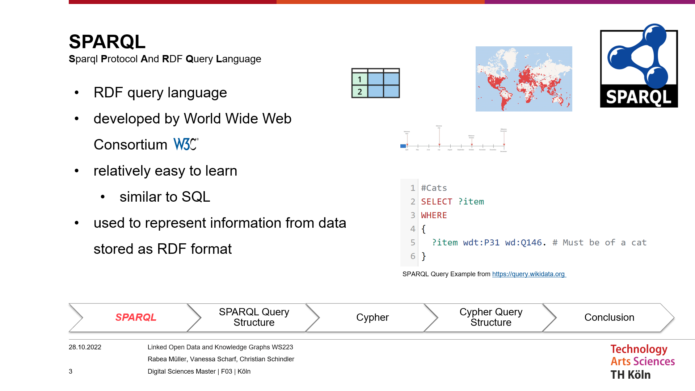
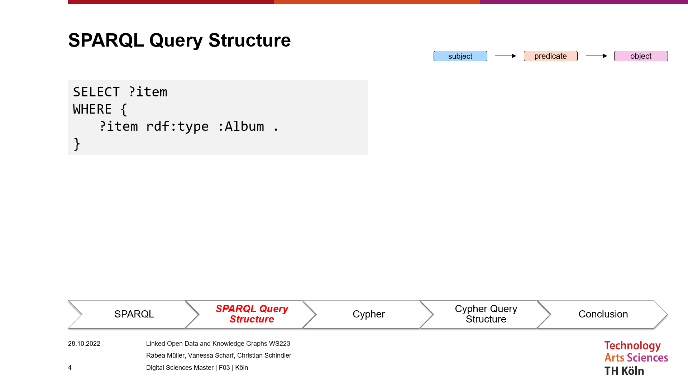
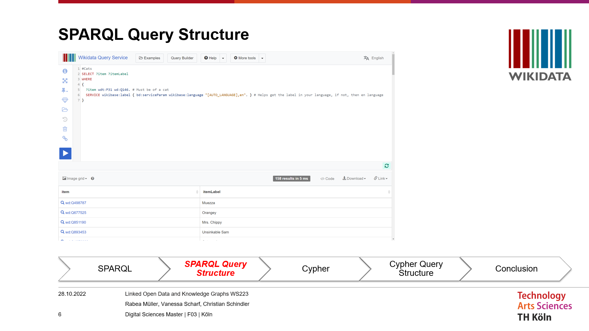
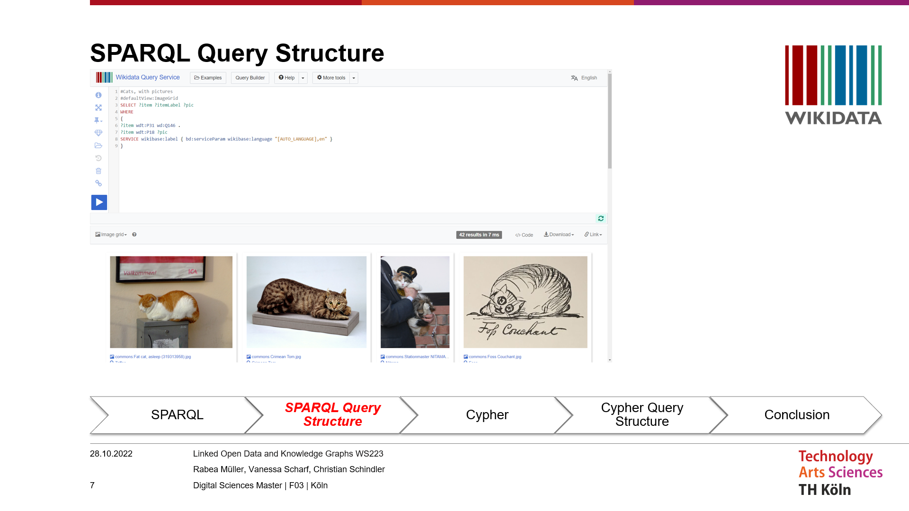
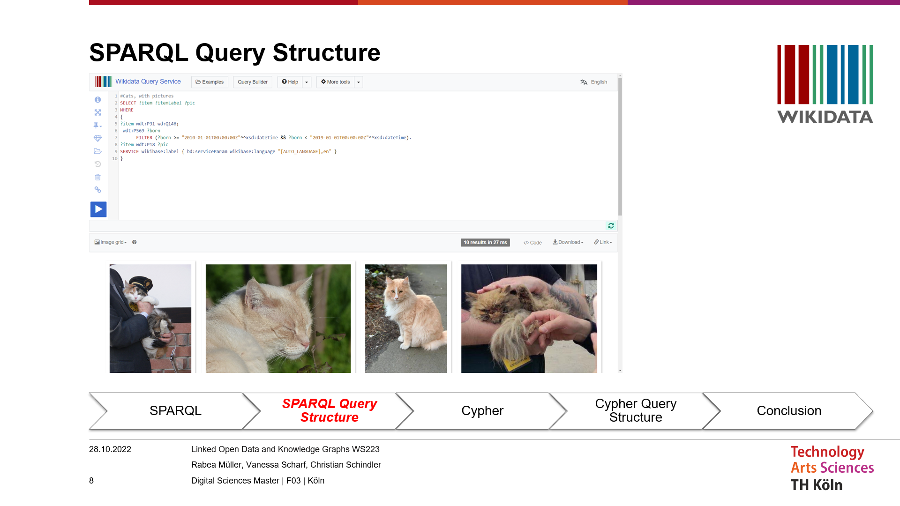
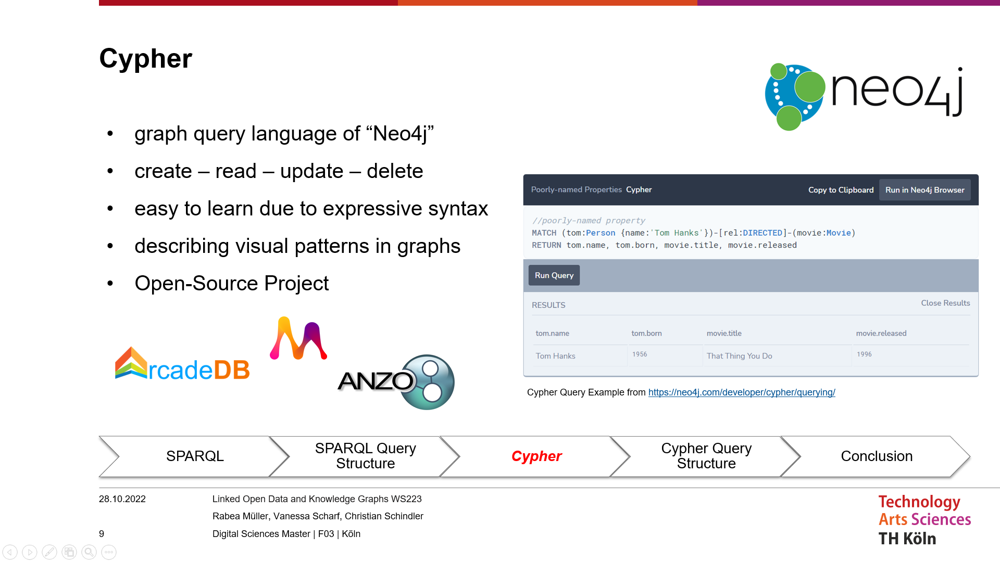
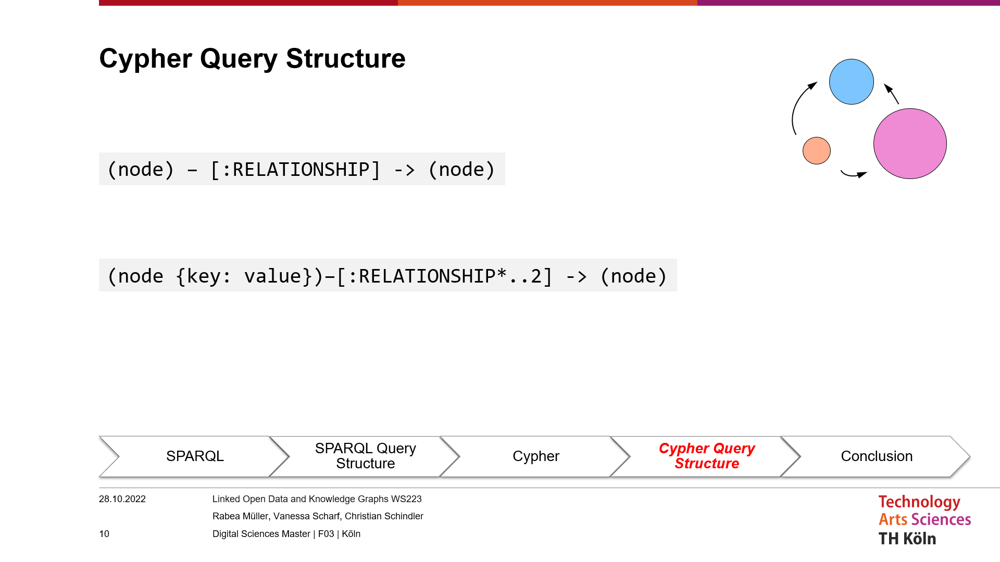
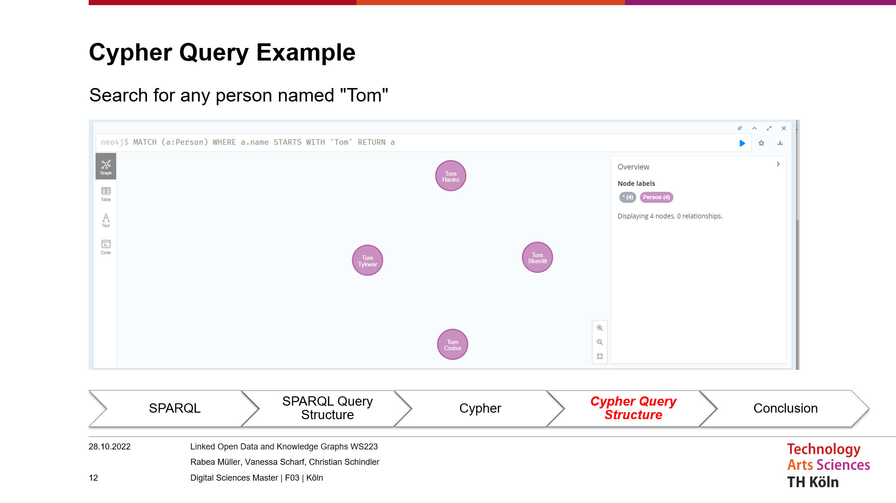
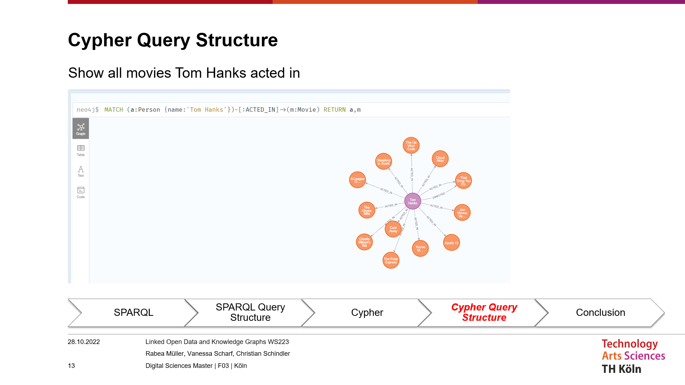
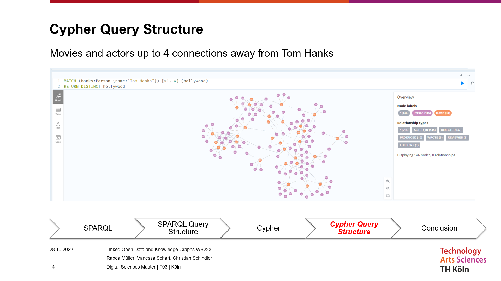

# SPARQL & Cypher

## SPARQL

- SPARQL (pronounced “sparkle”) is an RDF query language for the Semantic Web and first appeared in 2008.
- SPARQL is developed by the World Wide Web Consortium (W3C) and along with RDF and OWL, it is one of the three core technologies of the Semantic Web. 
- The syntax here is relatively easy to learn, similar to SQL, and is reminiscent of English sentence structure. Like this example: "Return me all items that contain house cats.“
- SPARQL is used to represent information from data stored as RDF format. The results from the queries can then in turn be visualized in different ways. For example, as in the Wikidata Query Service as a table, timeline or map.

Let's take a closer look at the structure of a SPARQL query. 
In this example, we assume that we are placing a SPARQL query on an RDF graph. That is, on a database that is in RDF format.
In this SPARQL query we want to return everything that is an album by type.
In the SELECT column we specify what we want to get back. In this case ?item. We assign this name item ourselves. Here could also be lasagna or album.
In the WHERE section we specify the conditions for the ITEM in the curly brackets. The condition is again represented in a triple, i.e. in the subject, predicate, object relation of an RDF triple. The item is an instance of an album.
We might additionally want to know who the artist of this album is. In that case we can expand the SELECT column and indicate in our WHERE section by the question mark that we are requesting this information.

What do we get back now? To take a look at a real example, let's look at [Wikidata's query service](https://query.wikidata.org). Wikidata also contains information in RDF format, which can then be queried with SPARQL.

Let's go back to our cat example. 
In this query, we want to get back all the domestic cats that are stuck in Wikidata.
The Q-numbers in this case are Wikidata specific and are the unique identifier for a Wikidata item. the P-numbers are the predicate. 
So here, give me all the items that are instances of a house cat.
The service line is just a little addition from Wikidata so we can get the names back below. It's not important to us right now.
But what is important for us is cat pictures. That’s what we are here for.

So let's extend our SPARQL query with the condition that we also get back the images that exist for the cats. We remember. This time the condition is built like when we searched for the artist of the album.

Now, to make the search even more complex we use the SPARQL keyword filter and specify that we want to get back only the cat images where the cat was born between 2010 and 2019. So we can see that we can make our queries more and more complex and link more and more information through the triple relation.  

What does the whole thing look like now with Cypher?

## Cypher

Cypher Query Language is Neo4j’s graph query language, invented by Andrés Taylor and first appeared in 2015. 
It’s used to perform various operations like create, read, update, and delete on the graph databases. 
Operations and Styles are inspired by SQL, the widely used structured query language, that first appeared in the 70s and is still built into pretty much every technology we know of.
Cypher is also easy to learn due to the expressive syntax and because neo4j provides good documentation on how to use Cypher.
Unlike SQL, Cypher is there for describing visual patterns in graphs. 
Cypher is not limited to the Neo4j database but is an open-source project and is used in other graph database projects from e.g. Amazon, ArcadeDB, Cambridge Semantics and so on…

Let's take a closer look at the structure of a Cypher query. Cypher is a declarative language in that we can specify in a query what data we want, not how we want it. 
Behind this is also the concept of graph pattern matching. That means we define the nodes inside the round brackets and Cypher then finds them inside the graph and we can specify in the square brackets how the nodes are related to each other.
This would be a very simple query, but you can also make more complex queries, so you can also query key-value properties or variable length paths or even query more relationships.

Now let's look at a real example. For our example, we have used a database from a Neo4j example, which mainly contains movies and their actors.
To run the queries we used the Neo4j Desktop Application, which is freely available for everyone.

In the first query, we search for all persons who have the first name Tom and exist in the Graph database and have these persons returned to us with "Return a".
Here we see, for example, Tom Hanks.

Then we wanted to know what movies Tom Hanks acted in everywhere. By having us return here not only the films but also the person. In the issue, we also see the relationship between the person and the film, i.e. "acted in".

And in our last example, we have displayed all the people and movies that are up to 4 connections away from Tom Hanks.
So we see that we can make both simple queries, but our requests can also be very complex.

## Conclusion

What is our conclusion about SPARQL and Cypher? 
Both SPARQL and Cypher are very powerful query languages, both building on the simplicity of SQL and giving us the ability to query information from graphical databases and in turn display it visually.
Both query languages have their own advantages and can be used in different environments, being both open sources and implemented in different projects.

