# Schema.org

### Table of Contents
- [Introduction](#introduction)
    - [What is schema.org](#what-is-schemaorg)
    - [Why use schema.org](#why-use-schemaorg)
    - [Who uses schema.org](#who-is-schemaorg-for)
	    - [Example use cases](#example-use-cases)
- [Schema Overview](#schema-overview)
    - [Types of Schemas](#type-of-schemas)
- [Demo](#demo)
- [Conclusion](#conclusion)
- [How to Contribute](#how-to-contribute)
- [References](#references)

---

## Introduction

>One goal of the Semantic Web field, is for web pages to contain structured data in a machine-readable format for intelligent agents and search engines. This is ideally done under a standardized set of definitions and vocabulary, that can be used for a myriad of types of different web pages and applications. For this purpose, schema.org offers one standardized solution.

### What is schema.org? 

Schema.org is a website that publishes a vocabulary (which provides specific terms to define different data types) and documentation on how to use this vocabulary in order to define structured data on web pages.

> 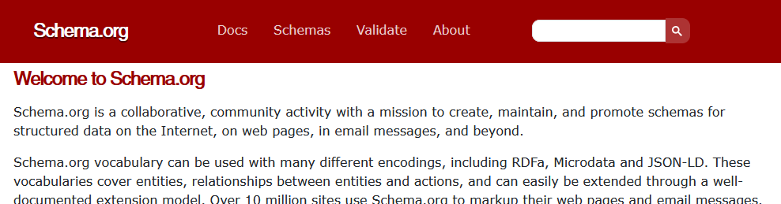  
*Image 1: The homepage for schema.org*

Although the purpose of this vocabulary is to improve the machine-readability of web pages, its main application is aimed at helping search engines understand the content, and not necessarily for virtual assistants or intelligent agents.

### Why use schema.org? 

In order to provide information about the actual content of a web page, you need to encode it with structured data. However, before schema.org existed, previous attempts to do this were very unsuccessful. Automated tools and extractors were inaccurate and buggy, and manual efforts were unpopular with Webmasters.

This was because the different vocabularies used were very non-standardized and specific to the different applications. For example, the FOAF vocabulary pictured below could only be used to describe social networks.

> 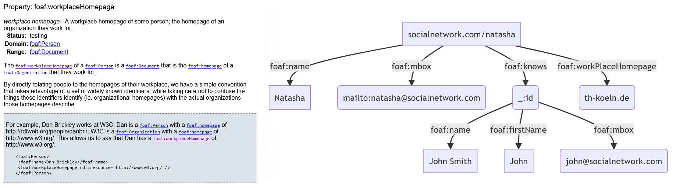  
*Image 2: The FOAF vocabulary for describing social networks.*  

Webmasters often found it too confusing to learn the disparate vocabularies for each individual application, and therefore elected to just skip the hassle of implementing structured data on their websites.

However, structured data is very helpful in particular for search engines, since helping a search engine to better understand the contents of webpages allows it to display better and more relevant search results in a SERP (search engine results page).

Thus in June 2011, 3 search engines (Google, Bing and Yahoo) started a collaboration to create schema.org. Their goal was to create a single, shared, consistent vocabulary schema for structured data, where just one vocabulary would cover and be integrated between all of the different kinds of data types and topics, and would work correctly with every different search engine.

> 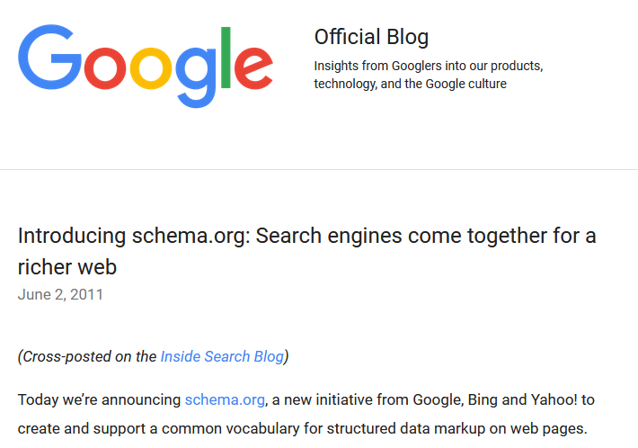  
*Image 3: The first introduction of the schema.org initiative*

### Who is schema.org for? 

The newly created schema.org website would contain extensive documentation, guidelines, helpful articles and support, as the goal was to encourage Webmasters to start using structured data on their websites.

The focus was on making the process as easy and accessible as possible in order to encourage uptake, which lead to a high rate of adoption on webpages: in 2015, 31.3% of webpages incorporated schema.org markup, including many big company websites. (Guha, Brickley, and Macbeth, 2016).

> 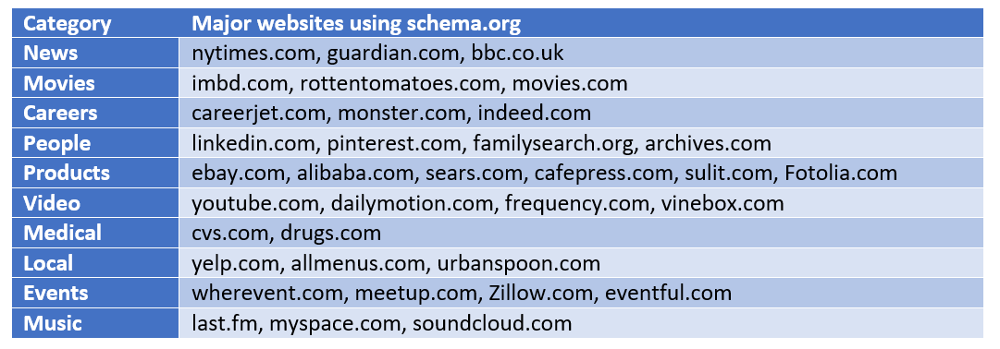  
*Image 4: A list of sites offering structured data via schemas *

### Example Use Cases

The main use of the schema.org structured data is in what Google calls "rich snippets". 

>   
*Image 5: An example of a rich snippet for recipes retrieved from google.com*

The benefit to the search engine user, is that their search results are more rich, more specific, and easier to parse, as the most important content of the webpage is displayed prominently on the search result, in a nicely formatted way.

The search engines themselves say that they are able to provide more targeted, relevant results, and a better user experience, which increases the likelihood of link click-through and engaging with their results.

> 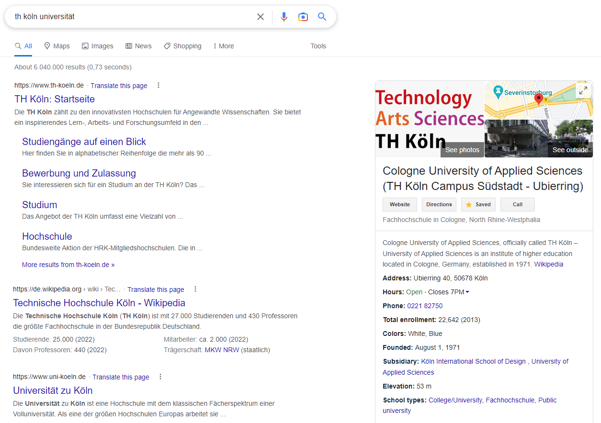  
*Image 6: A rich snippet for TH Köln*

Furthermore, although schema.org's vocabulary was originally intended for use in search engine results, it has also developed into being used by automatic assistants. For example, when you get an email about a flight or restaurant, and it gets automatically imported into your Google calendar.

> 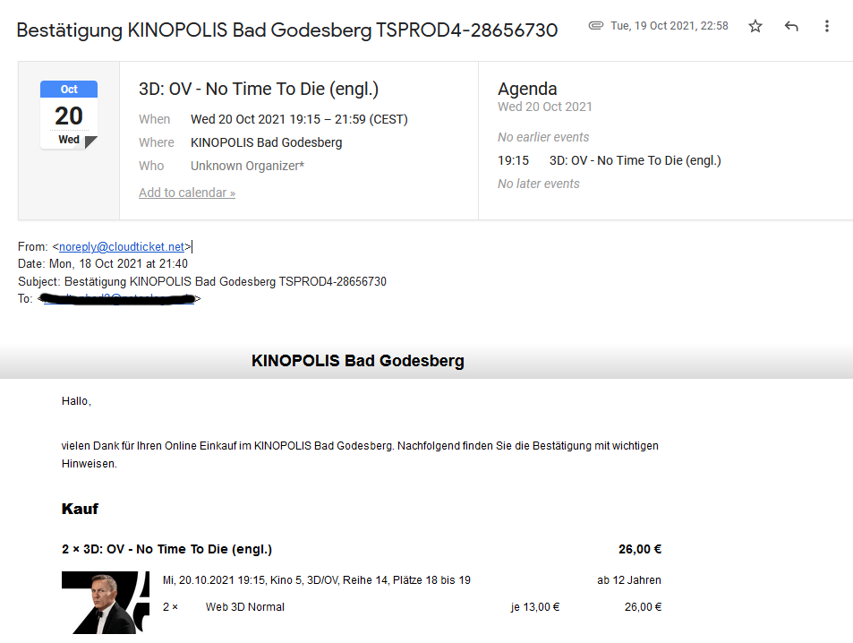  
*Image 7: A rich snippet from a ticket booking for the movie 'No Time to Die'*

But how is all of this actually implemented in the code?

---


## Schema Overview
Schemas are a set of types, each associated with a set of properties and specific hierarchy. The overall semantic vocabulary includes:  
* 797 Types *(Person, Event, Location)*  
* 1453 Properties *(Age, Location, Geoloaction)*  
* 14 Data Types *(Text, Time, DateTime, Boolean, Number)*  
* 86 Enumerations  
* 462 Enumeration Members  

As an example, the Type *"Person"* can contain these kind of properties as structured data as per documentation:
> 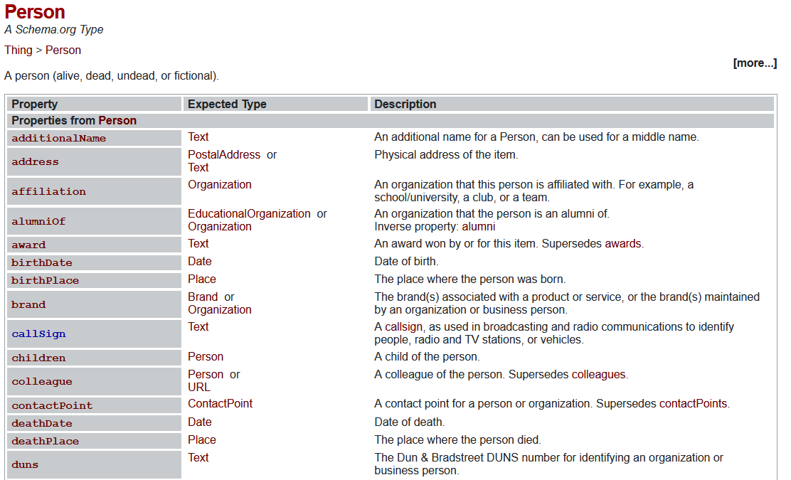  
*Image 8: The properties of the type '[Person](https://schema.org/Person)*

## Type of Schemas
Structured Data in the form of schemas can be implemented in a website in multiple formats such as:
* [Microdata](https://html.spec.whatwg.org/])
* [RDFa](https://rdfa.info/)
* [JSON-LD](https://json-ld.org/)  

in which the schema supplies the intelligent agent additional information for the relevant site upon request in a structured, machine-readable manner.

#### Microdata
A `WHATWG HTML` specification, where the structured data is embedded within the `HTML source code` via `attributes` in a non-repeated manner.  
[https://html.spec.whatwg.org/](https://html.spec.whatwg.org/)

#### RDFa
An extension to HTML5 for the purpose of publishing `linked RDF data` in HTML5 documents, combining the features of `Microdata` and `RDF` in a single format. While it can be embedded into the HTML source code, it also has compability with other languages such as Javascript, PHP, Python, Ruby, Java, C and Facebook's Open Graph Protocol.  
[https://rdfa.info/](https://rdfa.info/)

#### JSON-LD
A lightweight `Linked-Data` format, where the structured data is contained within a `HTML script tag`, enabling `modular ` implementation of the structured data into the HTML source code. It is also available for other programming environments such as Python, Go, C#, PHP and Typescript.  
[https://json-ld.org/](https://json-ld.org/)

### Example: Different Type of schemas
The following information displayed about the person `George Bush` 
```
George Bush, the 41st President of the United States is the father of George W. Bush, the 43rd President of the United States.
```
could be enriched through structured data with the following types and properties:

> 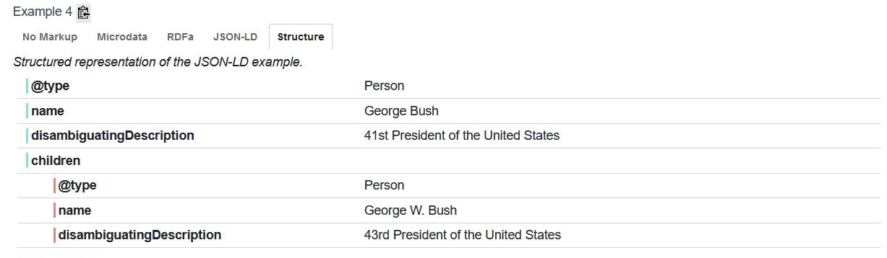  
*Image 9: The types and properties of 'George Bush'*

This can be illustrated in the following examples for different formats:
#### Microdata
> 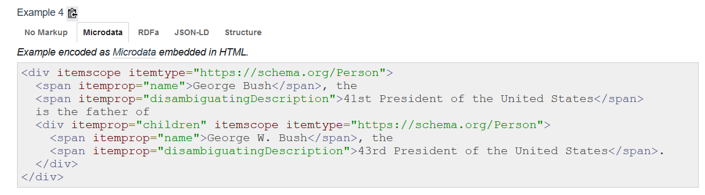  
*Image 10: The types and properties implemented in the microdata format within the HTML source code*

#### RDFa
> 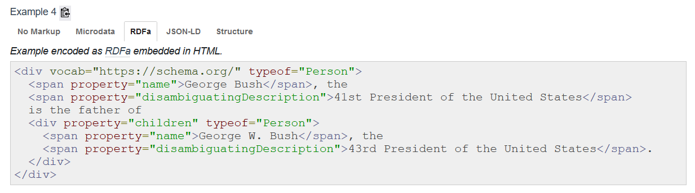  
*Image 11: The types and properties implemented in the RDFa format within the HTML source code*

#### JSON-LD
> 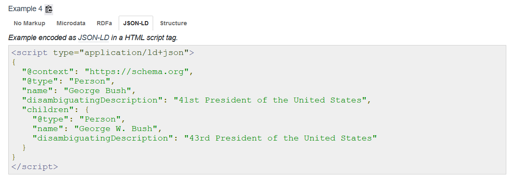  
*Image 12: The types and properties implemented in the JSON-LD format within a script tag in a modular manner*

## Demo
As a matter of demonstration, this section will demonstrate how **Google's Rich Snippet Tester** and **schema.org's validator** reads and validates available structured data on the example website with the search:  
> https://www.google.com/search?client=firefox-b-d&q=lemon-meringue-pie

Where the information is clearly displayed in Google's Rich Snippet including:
- Website Name
- Rating
- Duration of the Recipe
- Ingredients

And by taking a link from a top search result from the SERP, it is possible to inspect the structured data via:  
#### Google's Rich Snippet Tester
> https://search.google.com/test/rich-results/result?id=AAu2JaFg2dbM6y6RNpZrRQ

#### Schema.org's validator
> https://validator.schema.org/#url=https%3A%2F%2Fsallysbakingaddiction.com%2Flemon-meringue-pie%2F

---

## Conclusion

The original goal of schema.org was to create a simplistic, standardised and easy to implement structured data vocabulary for the semantic web. However over time Webmasters started demanding more complexity in the schema to fulfil their specific application needs.

The intention of schema.org was always to have a process of "incremental complexity" and continual development. The schemas were intended to be slowly updated over time using a very practical approach, based on the feedback from users.

Schema.org would provide the "common core" of key topics and vocabulary, making it easy to get started, while the community creates new vocabulary "extensions", adding optional specialised detail for specific applications.

> 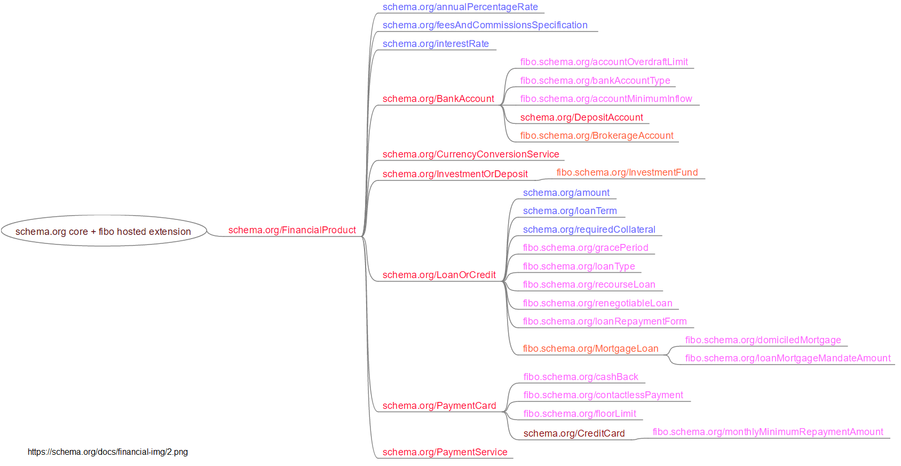  
*Image 13: Extensions to the original schema.org implementation*

Some of these extensions ended up being integrated into the core schema.org, such as IPTC's rNews extension, which added the "NewsArticle" type to the core vocabulary.

### How to contribute

In 2014 the schema.org schemas were published openly on [https://github.com/schemaorg](Github) under a Creative Commons Attribution-ShareAlike Licence. 

>   
*Image 14: The schema.org Github*

Schema.org went from being run by the Web engine companies, to becoming a collaborative, community project, where anyone can participate via the forums, mailing lists or on Github - from simply reporting problems to modifying the schemas.

Although exact reports of schema.org usage today are difficult to quantify, whenever you Google a topic and get rich results back, you can see the evidence of the impact and widespread use of schema.org's structured data.

> 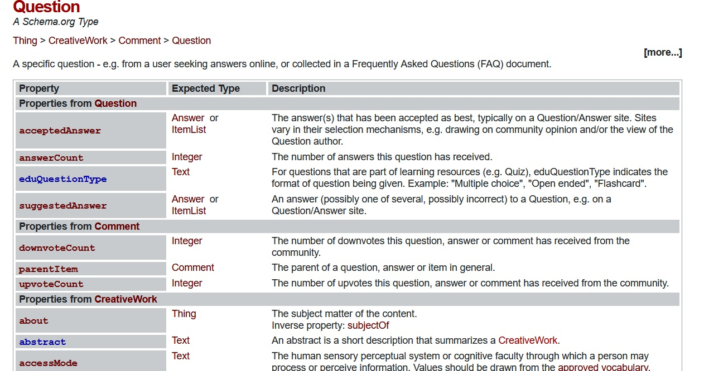  
*Image 15: The properties of the type 'question' from the general vocabulary from schema.org*

---

## References

> https://schema.org/

> https://github.com/schemaorg/schemaorg

> Guha, R.V., Brickley, D. and Macbeth, S., 2016. Schema.org: evolution of structured data on the web. Communications of the ACM, 59(2), pp.44-51.    

> Google (2011, June 2). *Introducing schema.org: Search engines come together for a richer web*. Google Blog. https://googleblog.blogspot.com/2011/06/introducing-schemaorg-search-engines.html  

> Google Developers (2022, September 15). *Understand how structured data works*. Google Documentation. https://developers.google.com/search/docs/appearance/structured-data/intro-structured-data  

> https://rdfa.info/dev

> https://json-ld.org/

> https://html.spec.whatwg.org/#microdata