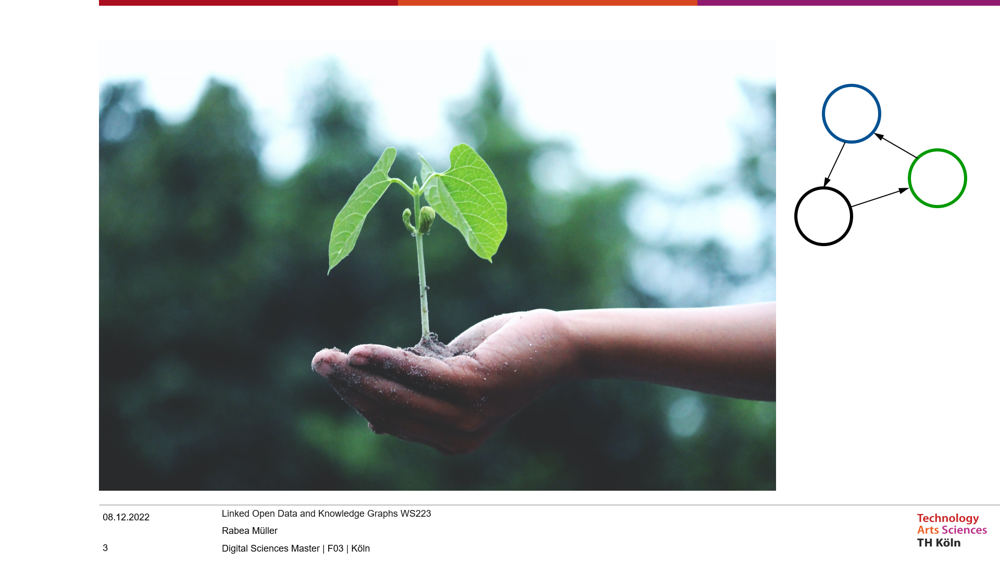

# Link Climate - Stichpunkte

While it becomes more and more important to understand and analyze the changes in our climate 
- not least because of climate change - more and more platforms are emerging that list different data about the climate. 
- Thus, it becomes more and more difficult for us to collect the required heterogeneous data from the different platforms 
- and to process them in a way that we can draw conclusions from them or analyze them.

The solution shall be a standard-based methodology for creating a climate knowledge graph, 
which combines all different sources in one service, making it possible to query and analyze climate-relevant data via one interface.

5. Which data is relevant?

For us important to get information about our climate is different data. On the one hand, meteorological 
variables such as wind, water, clouds, temperature, etc...
On the other hand, socio-economic variables play a role that are region-specific, such as the gross domestic product,
transport routes, agricultural and industrial production

6. Where is the data retrieved from?

On the one hand historical climate data from climate data providers are to be used. 
As an example in the paper, data will be sourced from NOAA (National Oceanic and Atmospheric Administration). 
Geographic information about weather stations will then be obtained from OpenStreetMap integrated. 
This data is then enriched using the identical location in Wikidata. W3C Semantic Web standards and Linked Data principles are taken into account.

7. Prework 

the KG facilitates the simultaneous study of numerous meteorological variables as well as cross-domain analysis of heterogeneous climate datasets.

Before the actual workflow started they proposed the Climate Analysis Ontology to represent the tabular NOAA climate data. 
They also chose OpenStreetMap because the knew geographic entities in OpenStreetMap are already linked to Wikidata for more semantic information. 
And to make it available for everybody they use Apache Jena Fuseki to configure a RDF database and open a SPARQL endpoint to query the Climate Knowledge Graph. 
In addition they adopted the tool LodView to derefernce the URIs with which every node in the Graph is associated with.

8. Workflow

First, the procedure starts by requesting climate data from the NOAA API. 
They used REST API because it is the most frequently changing, lightweight and least constrained 
for creating the climate observations Knowledge Graph in this study.

Second, OpenStreetMap-based geographic information, such as counties and cities of climate stations, 
is integrated to enrich the Knowledge Graph serving as the reference for including the corresponding 
identical entities in Wikidata. Finally, they use a Linked Data platform to publish the Knowledge Graph 
and dereference all URIs of entities and concepts for data navigation over HTTP.

9. Upper-level semantics creation

For the Knowledge graph they also needed a domain specific ontology, so a collection of human- and machinereadable vocabularies 
for describing concepts and relationships conducted by data. Therefore they reused parts of open ontologies, e.g. the SSN/SOSA ontology 
(sensors modeling) to organize NOAA climate data obtained over HTTP to develop the semantics of the climate Knowledge Graph.

The data was acquired through the NOAA Service APIs and through a simple subject-predicate-object grammar to provide more human-understandable 
interpretations for the data.

To create the ontology for the climate analysis, the data structure of the NOAA API was first looked at. 
This has a base url and is additionally subdivided into e.g. the stations. These can then be further restricted, 
e.g. only the stations from the UK. These endpoints of the API were then compared with the Climate Analyses 
classes that were created and provided with an interpretation.

In addition to the Climate Analysis ontology classes, there are also properties. In the image here we can see how the 
NOAA endpoints are described by the CA. For example this endpoint containing stations is of type Station.

The ontology for CA is thus aligned with other ontologies, for example classes with the same meanings are identified. 
In addition, the ontology is extended manually and is based on W3C standards, i.e. it is built according to an RDF schema.

10. Implementation

The workflow is built by a set of Python scripts which are available in the Github repository. 
The scripts implements functionalities including definition of the proposed CA ontology, weekly 
retrieval of online NOAA climate data and data transformation and storage as Linked Data. 
By now they have 14 million RDF triples about climate data stored in their Jena/Fuseki SPARQL endpoint.

11. Evaluation 

Competency questions  are a collection of questions proposed by a group of domain stakeholders for the purpose of evaluating 
a system’s capacity. So they compiled 11 competency questions for LinkClimate to address, including: 
- Where are all the stations that are located in a particular administrative region?
- Which station is the nearest to a certain station?
- Which stations fall inside a certain range of latitude and longitude coordinates?
- How can I group stations according to a particular observed climatic variable?

The evaluation results indicated that SPARQL queries are capable of providing adequate responses to competency questions.

12. Web Interface

As an user interface they created a supplementary instructional website for users who are unfamiliar 
with the Knowledge Graph database and its involved operations. Users can learn about the Climate Analysis 
ontology through schematic diagrams presented on the [website](http://jresearch.ucd.ie/linkclimate/index.html) and then have some quick hands-on queries to 
the SPARQL endpoint by following a step-by-step beginner’s guidance. Third-party tools used in this project 
such as Jena Fuseki, are also detailed on the website so that users can learn how to utilize them. Finally, 
a usability test has been undertaken to obtain first-hand feedback from testing participants about their experience on using the website.

[SPARQL Endpoint Query Service](http://jresearch.ucd.ie/kg/dataset.html?tab=query&ds=/climate#query=BASE+%3Chttp%3A%2F%2Fjresearch.ucd.ie%2Fclimate-kg%2F%3E%0APREFIX+ca_property%3A+%3Chttp%3A%2F%2Fjresearch.ucd.ie%2Fclimate-kg%2Fca%2Fproperty%2F%3E%0APREFIX+xsd%3A+%3Chttp%3A%2F%2Fwww.w3.org%2F2001%2FXMLSchema%23%3E%0APREFIX+sosa%3A+%3Chttp%3A%2F%2Fwww.w3.org%2Fns%2Fsosa%2F%3E%0APREFIX+rdfs%3A+%3Chttp%3A%2F%2Fwww.w3.org%2F2000%2F01%2Frdf-schema%23%3E%0APREFIX+qudt%3A+%3Chttp%3A%2F%2Fqudt.org%2F1.1%2Fschema%2Fqudt%23%3E%0A%0ASELECT+%3Fstation%0AWHERE%7B%0A%09%3Fstation+a+%3Cca%2Fclass%2FStation%3E+%3B%0A%09%09ca_property%3AisLocatedIn+%3Cresource%2Flocation%2FFIPS%3AEI%3E+.%0A%7D)
To use the query service for the climate database, users have to add `/sparql` to the SPARQL endpoint.

13. Conclusion

To summarize the purpose of this paper and LinkClimate: it targets online climate data, which contains data 
of meteorological variables and meteorological stations from throughout the world. They fetch these data archives 
and construct a climate Knowledge Graph to store them. The Knowledge Graph is then automatically synchronized 
with the dynamic data sources and published on an Open Linked Data platform, publicly available on the Web. 
Unfortunately only available by request.

