## Learning a Health Knowledge Graph from Electronic Medical Records
*Rotmensch, M., Halpern, Y., Tlimat, A., Horng, S., & Sontag, D. (2017). Learning a health knowledge graph from electronic medical records. Scientific reports, 7(1), 1-11. Released under CC BY 4.0.*

*Presentation by Natasha Randall.*

## Contents
- [Introduction](#introduction)
	- Purpose
	- Problems
- [Automated Learning from Medical Records](#automated)
- [Extracting the Data](#extracting)
- [Algorithms to Construct the Knowledge Graph](#algorithms)
	- Logistic Regression
	- Naïve Bayes
	- Noisy OR
- [Evaluating the Knowledge Graph](#evaluating)
- [Further Development](#further)

---
## Introduction 

The aim of this study was to examine the feasibility of creating a health knowledge graph using an automated process extracting data from hospital medical records, rather than constructing it manually. The knowledge graph uses nodes to represent diseases and symptoms, with edges representing the relationship between a particular symptom and disease, where the edge weight represents the strength of the connection. 

> 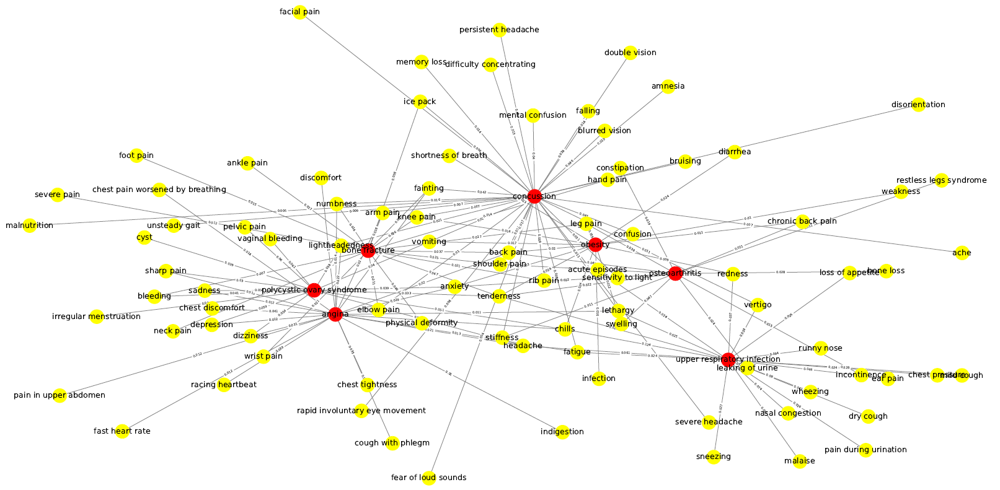  

## Purpose 

Health knowledge graphs can serve two main purposes:

* Supporting physicians in making medical decisions. The information from the health knowledge graph can help physicians with difficult cases to narrow down a list of potential diseases based on the given symptoms, or to flag up diagnoses they had not considered. Some models have even been shown to outperform experienced doctors.

* As a self-diagnosis system for patients. The Google Health Knowledge Graph (GHKG) is an end-user targeted model, which suggests possible diseases based on the symptoms that a user has googled. According to Google, in 2015, 1 in 20 of all searches were for health-related information. By getting that information from a curated Knowledge Graph rather than a dubious "health" website, the user receives much more reliable and less sensationalist results.

> 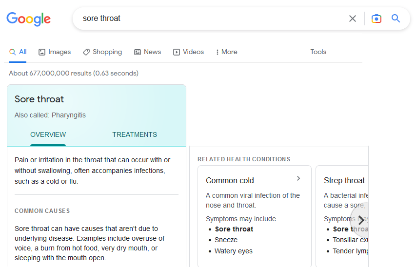  
> *Google results for symptoms and related diseases, taken from the Google Health Knowledge Graph.*

## Problems

The current approach to create Health Knowledge Graphs is to build them manually, requiring a huge amount of work. "15 person years" were needed to construct the Internist-1 QMR knowledge base of medicine. The GHKG was described as having been created through intense efforts and extensive manual construction and curation by medical experts.

This approach also means that the knowledge graphs cannot be kept completely up to date at all times, and neither can they quickly adapt to new diseases or information, due to the manual reviews required.

## Automated Learning from Medical Records 

Given these problems, this study aimed to test whether a reliable, effective health knowledge graph could be generated automatically, based on scraping data from hospital patient records. This approach would be contrasted to the traditional approach of manual construction based on common medical knowledge and definitive medical textbooks.

>   
*Belden, J (2012) "Index Card Doctor's Progress Note". Flickr. https://flic.kr/p/bgLBop. Distributed under CC BY-NC 2.0.*  
*Connor, A (2012) "Oxford Textbook of Medicine". Flickr. https://flic.kr/p/dGQKQB. Distributed under CC BY-SA 2.0.*

However this method comes with some **disadvantages**:

* The language used in medical reports is much less formal and more casual than that used in textbooks, making the information far more difficult to interpret.
* In the information, we only know what symptoms the medical staff decided to write down on the reports, not necessarily all of the symptoms a patient had, potentially introducing a bias.
* Real patients have multiple diseases at once, comorbidities and confounding and irrelevant factors, however a medical report can only describe associations and co-occurrences; whereas a textbook can illustrate causality and the actual connections between symptoms and diseases.

Nevertheless, there are many **advantages** associated with automated methodologies:

* By using a real world view of the actual occurrences of symptoms and diseases in real patients, an automated approach may be able to discover new associations that have not yet been recognised in textbooks, or have been dismissed by physicians. 
* All information can be kept extremely up-to-date, as real world data can be continuously generated, processed, and added to the knowledge graph. Due to the extremely large amount of data available and the automated systems processing it, complex or specialised graphs can be quickly and easily created.
* No medical knowledge is required to construct the knowledge graph. Any developer can work on improving the graph generating algorithms, without necessarily needing to understand its contents. The process is fast and efficient, with minimal maintenance required.

## Extracting the Data 

The information firstly needed to be extracted from the digital medical records. At the hospital used by the study, each patient had a medical record describing their reported symptoms and final disease diagnosis. The information in the records was represented in both structured and unstructured forms.

> 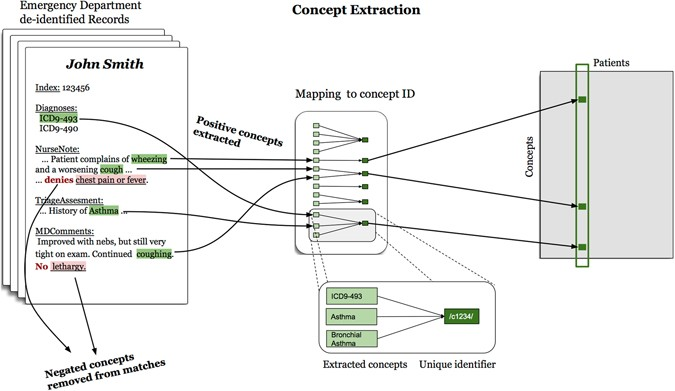  

**Structured**: ICD-9 codes (International Classification of Diseases, 9th version) refer to a standardised system commonly used in the US, which assigns diseases to agreed upon codes. These codes were written on the records to represent different disease diagnoses.  

**Unstructured**: The medical reports also contained free text written by the physicians, describing the patient's state, symptoms, and possible diagnoses. A program called "PhysioNet de-identification" was used to scan the text and extract relevant mentions of diseases and symptoms. It was also important to be able to correctly identify "negations", i.e. if a doctor wrote that a patient had "no pain", then text extractor should not extract "pain" as a symptom.

After extraction, the diseases and symptoms were **mapped** to the common identifier code used in the Google Health Knowledge Graph. This was done to consolidate together mentions of the same disease from the ICD-9 codes, text format, shortened forms, etc., and so that the new health knowledge graph could be more easily compared to the Google Health Knowledge Graph.  

Finally the extracted data was **stored in a matrix form**, with each unique patient representing a column in the matrix, and the identifier for a unique disease or symptom representing each row. The values in the matrix indicated whether a particular disease/symptom was present for a particular patient. 

## Algorithms to Construct the Knowledge Graph 

A model needed to be constructed to calculate the size of the edge weights between the symptoms and the diseases, i.e. to find the strength of the association between a symptom and a disease. For example, a highly weighted edge between the symptom "cough" and the disease "flu" indicates a strong relationship between the two.

Three different algorithms which could calculate these edge weights were tested: **Logistic regression, Naïve Bayes,** and **Noisy OR.** Maximum likelihood estimation was used to estimate the parameters, with hyperparameters chosen to reduce overfitting; in reality, diseases should not lead to an overly large number of symptoms, therefore regularisation was used to restrict the number of symptoms highly associated with each disease.

> 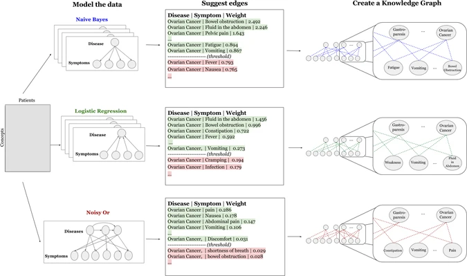  

### Logistic Regression 
The logistic regression algorithm was chosen as it is a commonly used, well established machine learning classifier.

A separate logistic regression model was created for each disease, where the variable to be predicted was the occurrence of the disease, and each symptom was an independent variable. Thus the model calculated whether if a symptom was present, was the occurrence of the disease more likely. 

The edge weights in the knowledge graph were taken from the coefficients in the model, thus if a particular symptom was a good predictor for the disease, it had a high edge weight association in the knowledge graph.

> 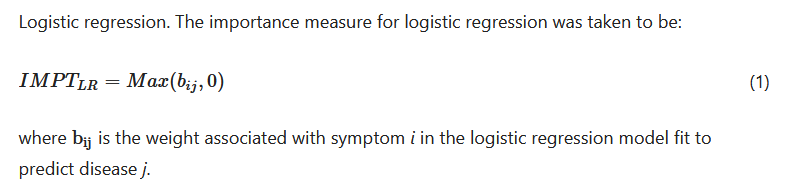  

### Naïve Bayes
The Naïve Bayes algorithm was chosen as a baseline, simple statistical model, that learns from basic associations and co-ocurrences of symptoms and diseases.

The edge weights in the model were calculated as: what is the probability a symptom occurs given that the disease is present, minus the probability a symptom occurs given that the disease is not present. Thus the model calculates a higher edge weight when a disease and symptom occur often together, with an emphasis on whether the presence of a particular disease increases the likelihood of a presence of a particular symptom.

> 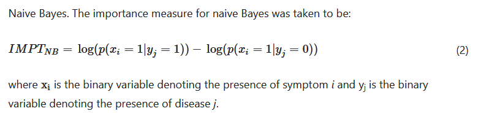  

### Model problems
A problem with both of these models is that they assumed independence between symptoms and diseases, however this is not at all true in reality. For example, if you have the symptom of "cough" then you are more likely to also have the symptom of "sore throat". If a patient is diagnosed with the disease "flu", then an additional diagnosis of "ear ache" is more likely than that of "broken foot".

Furthermore, both models could not properly capture the complex interactions and confounding factors between symptoms and diseases. For example, an elderly person is more likely (than a younger person) to have bone loss, and also more likely to have Shingles (a body rash). However it is wrong for the model to associate bone loss with Shingles - one does not cause the other, rather they are both associated with the confounding factor of being old! 

### Noisy OR
The Noisy OR algorithm is more complicated than the previous two algorithms, as it models all of the diseases and symptoms at the same time, and tries to infer causality between them, not just associations or co-occurrences. 

The way it works is: in a "perfect" scenario, if a disease is present, then it always triggers its related symptoms to occur. The "noisy" aspect of the algorithm reflects that the real world is not always this perfect. Thus the model contains a term "f", reflecting the probability that a present disease failed to trigger a related symptom.

The edge weights in the model are calculated as 1-f, i.e. the probability that the disease does trigger the symptom to occur. In this way, the model is trying to capture causality, rather than just co-occurrences. As a result, noisy OR was found to be the best algorithm when evaluating the resulting knowledge graphs.

> 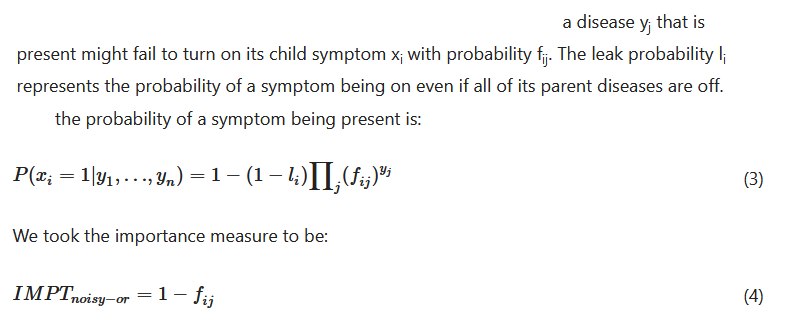  

## Evaluating the Knowledge Graph 

The knowledge graph was then generated, with the edge weights connecting symptoms to diseases calculated as previously described. Two measures were used to evaluate the "correctness" of the resulting graph:  

**Precision:** Given the associations identified, how many of them were correct?  
**Recall**: Given all of the correct associations that exist, how many of them were identified?  

> 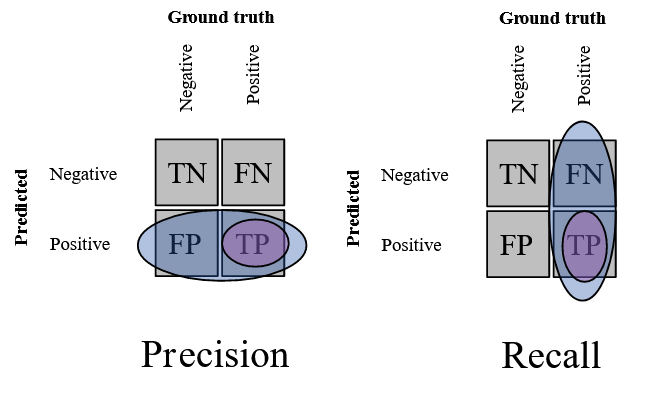    
> *FreeSVG (2022) "Precision, recall and false positive rate". https://freesvg.org/precision-recall-fpr. Distributed under CC Public Domain.*

The "correctness" of the associations was firstly measured by being **evaluated by expert physicians**.  
The experts evaluated recall: "did the knowledge graph identify all of the symptoms that should have been associated with a disease?"  
And precision: "were all of the associations that the knowledge graph made correct?"

The created knowledge graph was also **compared to the Google Health Knowledge Graph**, and in this evaluation it scored low when measured on precision, i.e. "given all the associations identified, how many of them exist on the Google Health Knowledge Graph"? 

The knowledge graph was found to score more highly on recall (identifying lots of correct associations) when evaluated by the physicians, leading to the conclusion that the graph was able to identify many legitimate associations that the manually constructed Google Health Knowledge graph had failed to include.

> 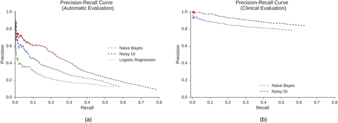  

The evaluation showed that not only was the automatically generated Knowledge Graph able to correctly describe associations between symptoms and diseases, it was also able to identify associations that the Google Health Knowledge Graph had missed, thus revealing the benefit of utilising the real world medical reports.

> 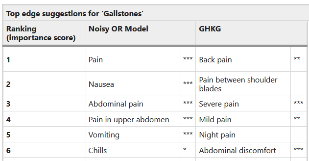  
> *The stars represent the physicians' likelihood ratings that the given disease causes the particular symptom.*

## Further Development 

Although the evaluation of the generated knowledge graph revealed a very successful result, the Noisy OR algorithm still has some limitations that need to be worked on:

* The model tended to associate diseases with more "general" symptoms over specific ones. This is unsurprising, as  optimising models for correctness often results in prioritisation of "safer" results over more specific ones that are also more likely to be incorrect. As a result, this somewhat reduces how informative and useful the knowledge graph can be in reality.  
* A limitation of the knowledge graph was that a disease could not be recognised as both a symptom and a disease in the graph, even though this occurs very often in reality. For example, "diabetes" is a disease, but it can also be a symptom of many cancers.

As the Noisy OR algorithm uses a model which integrating the diseases and symptoms all together, it is very possible that a modified algorithm could be created in the future that resolves these problems.

Finally, the data used in this study were 273,147 patient records from an Emergency Hospital in the United States. The use of an *emergency* hospital biased the input data, as more extreme symptoms occurred more frequently in the knowledge graph than is realistic in a general setting, and the frequency of appearance of certain diseases was skewed compared to reality.

Therefore, further development of this research should use a much broader scale of input data from different hospitals. However, even given the limitations of the study, the results from the Knowledge Graph generating algorithms were extremely impressive. The scale of what was achieved by a relatively easy-to-implement automated system, when compared to the laboriously manually constructed Google Health Knowledge Graph, reveals an incredibly promising result.

> 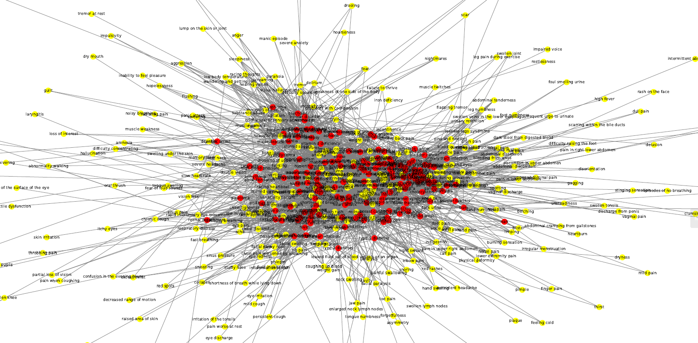  